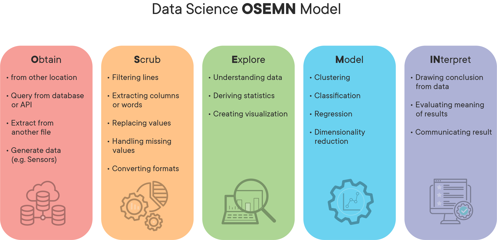

# clickbait_headline_detector

## Purpose
Clickbaits are internet links that is designed to attract attention and to entice users to follow that link and read, view, or listen to the linked piece of online content, with a defining characteristic of being deceptive, typically sensationalized or misleading.

## Process - OSEMN Model

## Results and Insights
Out of the five models that were implemented (Naive Bayes, Logistic Regression, Random Forests, KNN, SVM), SVM with word embeddings (SpaCy) performed the best, with a 92% F-1 score.
This result may be 
