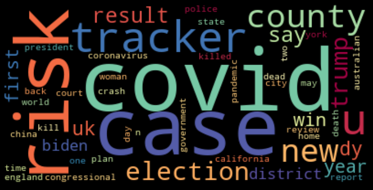

# Clickbait Headline Detector

## Purpose
To detect clickbait articles based on their headlines using Natural Language Processing and various Machine Learning algorithms.

## Overview
- **Clickbaits** are internet links that entice users to follow their link to read, view, or listen to their contents, which are typically composed of sensationalized or inaccurate information.
- headline text data were successfully tranformed to a series of numerical arrays which were then fed into various machine learning models.
- Out of the five models that were implemented (Naive Bayes, Logistic Regression, Random Forests, KNN, SVM), SVM with word embeddings (SpaCy) performed the best, with a **92% F-1 score**.

## Process - OSEMN Model

### Step 1: Obtain
Kaggle (32,000)
- clickbait headlines from ‘BuzzFeed’, ‘Upworthy’, ‘ViralNova’, ‘Thatscoop’, ‘Scoopwhoop’ and ‘ViralStories’ (16,000)
- non-clickbait headlines from ‘WikiNews’, ’New York Times’, ‘The Guardian’, and ‘The Hindu’ (16,000)
Webscraping from clickbait websites (16,707)
- clickhole.com (4,526)
- worldtruth.tv (12,181)
API's from major press companies (16,660)
- The New York Times (11,460)
- The Guardian (5,200)

Total of 65,367 headlines - 32,707 clickbait and 32,660 non-clickbait headlines

### Step 2: Scrub
- Check for null values
- Tokenized data
- Checked for encoding or strange words
- Removed stopwords
- Separated numeric characters and non-numeric characters
- Lemmatized non-numeric list of words

### Step 3: Explore
- Lemmatized lists' frequency distribution and wordclouds
**Clickbait Headlines**

**Nonclickbait Headlines**

### Step 4: Model
- Test-train split: 75:25 split
- **F1-score** was chosen to be the representative metric for model evaluation, because it is generally the most strict metric, and tends to penalize more on wrong predictions.

- Naive Bayes
  - Train F1-score: 99.8939%
  - Test F1-score: 90.0270%
- Random Forests
  - Train F1-score: 99.9959%	
  - Test F1-score: 86.3288%
- SVM (Support Vector Machines)
  - Train F1-score: 99.9980%
  - Test F1-score: 90.2046%
- Logistic Regression
  - Train F1-score: 99.9980%	
  - Test F1-score: 90.1803%
- KNN (K-Nearest Neighbors)
  - Train F1-score: 91.1718%
  - Test F1-score: 84.7322%

### Step 5: Interpret
Below is the feature importances graph, generated from the Random Forest model:

- Clickbait headlines' main objective is to grab people's attention - frequently used forms of text include:
  - numerical values (i.e. **32** Cute Things To Distract From Your Awkward Thanksgiving)
  - informal language (i.e. Does Coffee Make You **Poop**)
  - vague language to trigger curiousity (i.e. Here's One Really **Weird Thing** About Butterfree)

- Nonclickbait headlines also try to grab people's attention, but are still primarily focused on delivering news information, including:
  - specific language that accurately delivers the main message (i.e. Albanian girl **murdered** in tangle of crime)
  - formal language and occasional use of jargons (i.e. Blair: **G8** leaders announce $50 billion aid increase; talks on trade and climate change)
  - heavily focused on safety, economics, and politics issues (i.e. **Fed** Calls Gain in Household Wealth a Mirage)

## Conclusion and Future Works
- It is possible to accurately predict whether an article is clickbait or not just by looking at the headline text, due to their noticeable differences
- Model performances may be improved with:
  - Additional data
  - Further feature engineering (i.e. length of headline, number of capitalied letters, whether headline starts with a number)
